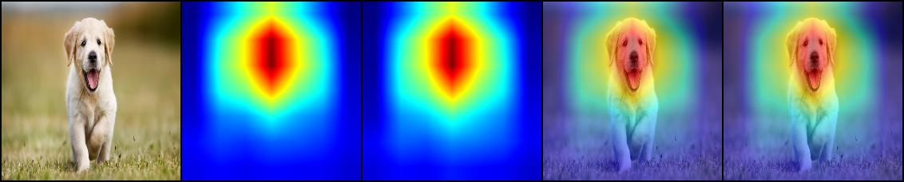

# Activation Map Visualization

Visualize the activation map using Grad CAM [1] approach.

## Results

## Usage

### Requirements

- Pytorch
- Torchvision
- PIL
- Opencv-python
- Numpy

Just run `pip install opencv-python torch torchvision` to install them.

Then, open `vis_activation.ipynb` to use it.

### Reference

[1] Ramprasaath R Selvaraju, Michael Cogswell, Abhishek Das, Ramakrishna Vedantam, Devi Parikh, and Dhruv Batra.
Grad-cam: Visual explanations from deep networks via gradient-based localization.
In Proceedings of the IEEE international conference on computer vision, pages 618–626, 2017.
